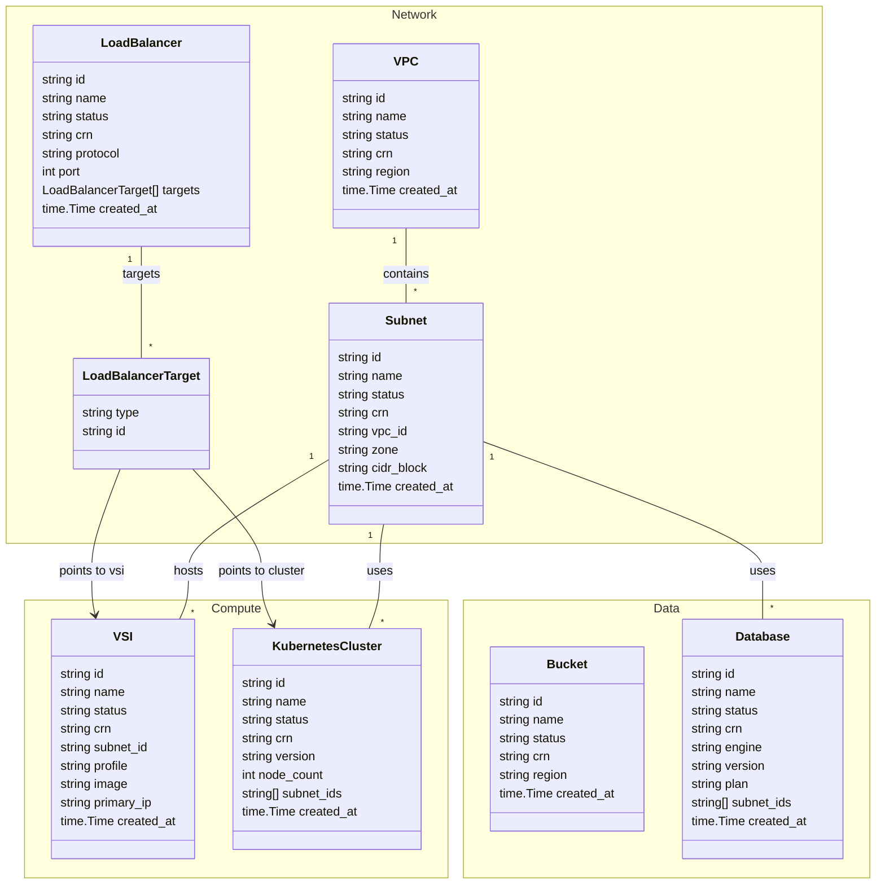

# NullCloud - backend

      

A fake cloud provider API — provision VPCs, subnets, and virtual server instances without any real infrastructure. Useful for demos, tests, and Terraform provider development.

> **Using Terraform?** The [terraform-provider-nullcloud](https://github.com/we-work-in-the-cloud/terraform-provider-nullcloud) wraps this API and lets you manage NullCloud resources with `.tf` files.

## Install

```sh
brew tap we-work-in-the-cloud/backend-nullcloud https://github.com/we-work-in-the-cloud/backend-nullcloud
brew install --cask nullcloud-backend
```

## Resources

- VPC
- Subnet
- Virtual Server Instance (VSI)
- Load Balancer
- Object Storage Bucket
- Managed Database
- Kubernetes Cluster

### Model Classes



## Auth

All requests require an `Authorization` header. Any non-empty string works. Resources are scoped to the token — different tokens are isolated from each other.

## Persistence

| Mode | Flag | Notes |
|------|------|-------|
| In-memory | _(default)_ | State lost on restart |
| JSON file | `--store-file <path>` | State persisted to disk |

## Run

```sh
# In-memory (default)
./nullcloud-backend

# With file persistence
./nullcloud-backend --store-file store.json

# Custom port (default: 8080)
./nullcloud-backend --port 9090
```

## Build

```sh
make build        # all platforms → dist/
make build-linux_amd64  # single platform
```

## Test

```sh
make test
```

## Release

Push a tag to trigger a GitHub Actions release with pre-built binaries for Linux, macOS, and Windows (amd64/arm64).

```sh
git tag v1.0.0 && git push origin v1.0.0
```
